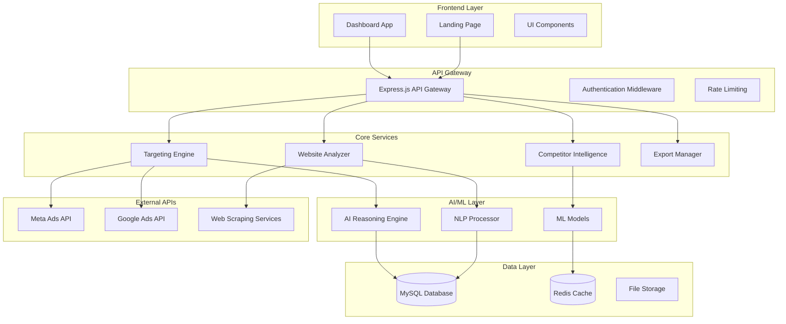
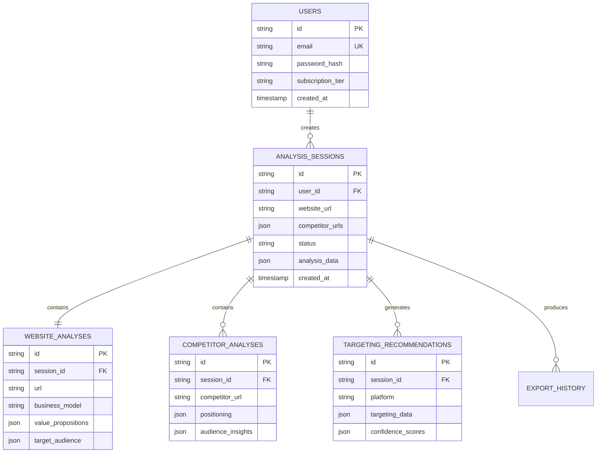

# Design Document: RiseRoutes AI Ads Intelligence Platform

## Overview

RiseRoutes is a sophisticated AI-powered platform that analyzes websites and competitors to generate actionable Meta and Google Ads targeting recommendations. The system combines advanced web scraping, natural language processing, and machine learning to provide zero-learning-curve insights with clear explanations of the "why" behind each recommendation.

The platform follows a modern, insight-first approach that prioritizes user understanding over complex configuration. Built with React frontend, Node.js backend, and MySQL database, it delivers a premium experience reminiscent of Stripe's polish, Notion's clarity, and ChatGPT's intelligence.

## Architecture

### High-Level System Architecture



### Technology Stack

**Frontend:**
- React 18 with TypeScript
- Tailwind CSS for styling
- Framer Motion for animations
- React Query for state management
- Chart.js for data visualization

**Backend:**
- Node.js with Express.js
- TypeScript for type safety
- JWT for authentication
- Bull Queue for background jobs
- Winston for logging

**Database:**
- MySQL 8.0 for primary data storage
- Redis for caching and session management
- File system for temporary analysis artifacts

**AI/ML:**
- OpenAI GPT-4 for content analysis and reasoning
- Custom NLP models for keyword extraction
- TensorFlow.js for client-side processing
- Puppeteer for web scraping

## Components and Interfaces

### 1. Website Analyzer Service

**Purpose:** Extracts and analyzes website content to understand business model, target audience, and value propositions.

**Key Methods:**
```typescript
interface WebsiteAnalyzer {
  analyzeWebsite(url: string, options: AnalysisOptions): Promise<WebsiteAnalysis>
  extractContent(url: string): Promise<WebsiteContent>
  identifyBusinessModel(content: WebsiteContent): Promise<BusinessModel>
  extractValuePropositions(content: WebsiteContent): Promise<ValueProposition[]>
  analyzeUserJourney(content: WebsiteContent): Promise<UserJourney>
}

interface WebsiteAnalysis {
  businessModel: BusinessModel
  valuePropositions: ValueProposition[]
  targetAudience: AudienceInsights
  contentThemes: ContentTheme[]
  userJourney: UserJourney
  technicalMetadata: TechnicalMetadata
}
```

**Analysis Process:**
1. URL validation and accessibility check
2. Content extraction using Puppeteer
3. Text analysis using NLP for key themes
4. Business model classification
5. Value proposition extraction
6. Audience signal identification

### 2. Competitor Intelligence Service

**Purpose:** Analyzes competitor websites and advertising strategies to identify market opportunities and gaps.

**Key Methods:**
```typescript
interface CompetitorIntelligence {
  analyzeCompetitors(urls: string[]): Promise<CompetitorAnalysis[]>
  identifyMarketGaps(competitors: CompetitorAnalysis[], target: WebsiteAnalysis): Promise<MarketGap[]>
  extractCompetitorPositioning(analysis: CompetitorAnalysis): Promise<Positioning>
  compareAudienceStrategies(competitors: CompetitorAnalysis[]): Promise<AudienceComparison>
}

interface CompetitorAnalysis {
  url: string
  businessModel: BusinessModel
  positioning: Positioning
  targetAudience: AudienceInsights
  contentStrategy: ContentStrategy
  estimatedAdSpend: AdSpendEstimate
  marketShare: MarketShareData
}
```

**Analysis Features:**
- Competitive positioning analysis
- Market gap identification
- Audience overlap detection
- Content strategy comparison
- Opportunity scoring

### 3. Targeting Engine Service

**Purpose:** Generates Meta and Google Ads targeting recommendations based on website and competitor analysis.

**Key Methods:**
```typescript
interface TargetingEngine {
  generateMetaTargeting(analysis: WebsiteAnalysis, competitors: CompetitorAnalysis[]): Promise<MetaTargeting>
  generateGoogleTargeting(analysis: WebsiteAnalysis, competitors: CompetitorAnalysis[]): Promise<GoogleTargeting>
  calculateConfidenceScores(targeting: TargetingRecommendation): Promise<ConfidenceScore[]>
  explainRecommendations(targeting: TargetingRecommendation): Promise<RecommendationExplanation[]>
}

interface MetaTargeting {
  demographics: DemographicTargeting
  interests: InterestTargeting[]
  behaviors: BehaviorTargeting[]
  customAudiences: CustomAudienceRecommendation[]
  lookalikeSuggestions: LookalikeAudience[]
  confidenceScores: ConfidenceScore[]
}

interface GoogleTargeting {
  keywords: KeywordCluster[]
  audiences: GoogleAudience[]
  demographics: DemographicTargeting
  placements: PlacementRecommendation[]
  confidenceScores: ConfidenceScore[]
}
```

**Targeting Logic:**
- Business model-based audience mapping
- Intent-driven keyword clustering
- Competitive gap targeting
- Confidence scoring algorithm
- Policy compliance validation

### 4. Export Manager Service

**Purpose:** Handles data export in various formats for different platforms and use cases.

**Key Methods:**
```typescript
interface ExportManager {
  exportMetaAudiences(targeting: MetaTargeting, format: ExportFormat): Promise<ExportResult>
  exportGoogleKeywords(targeting: GoogleTargeting, format: ExportFormat): Promise<ExportResult>
  generateClientReport(analysis: AnalysisSession): Promise<ClientReport>
  copyToClipboard(data: TargetingData, platform: AdPlatform): Promise<ClipboardData>
}

interface ExportResult {
  filename: string
  format: ExportFormat
  data: Buffer | string
  metadata: ExportMetadata
}
```

**Export Formats:**
- CSV for direct platform import
- JSON for API integration
- PDF for client presentations
- Clipboard-ready text formats

### 5. Dashboard Interface Components

**Purpose:** Provides intuitive UI components for displaying analysis results and insights.

**Key Components:**

```typescript
// Audience Card Component
interface AudienceCard {
  audience: AudienceSegment
  funnelStage: FunnelStage
  confidenceScore: number
  explanation: string
  actions: AudienceAction[]
}

// Intent Cluster Component
interface IntentCluster {
  intent: UserIntent
  keywords: Keyword[]
  searchVolume: number
  competitionLevel: CompetitionLevel
  opportunities: Opportunity[]
}

// Competitor Radar Chart
interface CompetitorRadar {
  competitors: CompetitorData[]
  metrics: RadarMetric[]
  opportunities: OpportunityGap[]
  recommendations: string[]
}
```

## Data Models

### Core Data Entities

```sql
-- Analysis Sessions
CREATE TABLE analysis_sessions (
    id VARCHAR(36) PRIMARY KEY,
    user_id VARCHAR(36) NOT NULL,
    website_url VARCHAR(500) NOT NULL,
    target_location VARCHAR(100),
    competitor_urls JSON,
    status ENUM('pending', 'processing', 'completed', 'failed') DEFAULT 'pending',
    created_at TIMESTAMP DEFAULT CURRENT_TIMESTAMP,
    completed_at TIMESTAMP NULL,
    analysis_data JSON,
    INDEX idx_user_created (user_id, created_at),
    INDEX idx_status (status)
);

-- Website Analysis Results
CREATE TABLE website_analyses (
    id VARCHAR(36) PRIMARY KEY,
    session_id VARCHAR(36) NOT NULL,
    url VARCHAR(500) NOT NULL,
    business_model VARCHAR(100),
    value_propositions JSON,
    target_audience JSON,
    content_themes JSON,
    technical_metadata JSON,
    analysis_timestamp TIMESTAMP DEFAULT CURRENT_TIMESTAMP,
    FOREIGN KEY (session_id) REFERENCES analysis_sessions(id) ON DELETE CASCADE,
    INDEX idx_session (session_id),
    INDEX idx_url (url)
);

-- Competitor Analysis Results
CREATE TABLE competitor_analyses (
    id VARCHAR(36) PRIMARY KEY,
    session_id VARCHAR(36) NOT NULL,
    competitor_url VARCHAR(500) NOT NULL,
    positioning JSON,
    audience_insights JSON,
    content_strategy JSON,
    market_share_data JSON,
    analysis_timestamp TIMESTAMP DEFAULT CURRENT_TIMESTAMP,
    FOREIGN KEY (session_id) REFERENCES analysis_sessions(id) ON DELETE CASCADE,
    INDEX idx_session (session_id),
    INDEX idx_competitor_url (competitor_url)
);

-- Targeting Recommendations
CREATE TABLE targeting_recommendations (
    id VARCHAR(36) PRIMARY KEY,
    session_id VARCHAR(36) NOT NULL,
    platform ENUM('meta', 'google') NOT NULL,
    targeting_data JSON NOT NULL,
    confidence_scores JSON,
    explanations JSON,
    created_at TIMESTAMP DEFAULT CURRENT_TIMESTAMP,
    FOREIGN KEY (session_id) REFERENCES analysis_sessions(id) ON DELETE CASCADE,
    INDEX idx_session_platform (session_id, platform)
);

-- Export History
CREATE TABLE export_history (
    id VARCHAR(36) PRIMARY KEY,
    session_id VARCHAR(36) NOT NULL,
    export_type ENUM('meta_csv', 'google_csv', 'client_report', 'clipboard') NOT NULL,
    filename VARCHAR(255),
    export_data JSON,
    created_at TIMESTAMP DEFAULT CURRENT_TIMESTAMP,
    FOREIGN KEY (session_id) REFERENCES analysis_sessions(id) ON DELETE CASCADE,
    INDEX idx_session_type (session_id, export_type),
    INDEX idx_created (created_at)
);

-- Users and Authentication
CREATE TABLE users (
    id VARCHAR(36) PRIMARY KEY,
    email VARCHAR(255) UNIQUE NOT NULL,
    password_hash VARCHAR(255) NOT NULL,
    first_name VARCHAR(100),
    last_name VARCHAR(100),
    company VARCHAR(200),
    subscription_tier ENUM('free', 'pro', 'enterprise') DEFAULT 'free',
    created_at TIMESTAMP DEFAULT CURRENT_TIMESTAMP,
    last_login TIMESTAMP NULL,
    INDEX idx_email (email),
    INDEX idx_subscription (subscription_tier)
);

-- Analysis Cache for Performance
CREATE TABLE analysis_cache (
    id VARCHAR(36) PRIMARY KEY,
    cache_key VARCHAR(255) UNIQUE NOT NULL,
    cache_data JSON NOT NULL,
    expires_at TIMESTAMP NOT NULL,
    created_at TIMESTAMP DEFAULT CURRENT_TIMESTAMP,
    INDEX idx_cache_key (cache_key),
    INDEX idx_expires (expires_at)
);
```

### Data Relationships



Now I need to use the prework tool to analyze the acceptance criteria before writing the Correctness Properties section.

<function_calls>
<invoke name="prework">
<parameter name="featureName">ai-ads-intelligence-platform

## Correctness Properties

*A property is a characteristic or behavior that should hold true across all valid executions of a system—essentially, a formal statement about what the system should do. Properties serve as the bridge between human-readable specifications and machine-verifiable correctness guarantees.*

Based on the prework analysis and property reflection, the following properties ensure system correctness:

### Property 1: URL Analysis Completeness
*For any* valid website URL provided to the Website_Analyzer, the analysis should return structured data containing business model, value propositions, target audience insights, and technical metadata.
**Validates: Requirements 1.1, 1.2**

### Property 2: Geographic Targeting Integration
*For any* target location specified during analysis, the generated targeting recommendations should include location-specific parameters for both Meta and Google platforms.
**Validates: Requirements 1.3**

### Property 3: Competitor Analysis Activation
*For any* list of competitor URLs provided, the Competitor_Intelligence should generate positioning analysis, audience insights, and market gap identification for each valid URL.
**Validates: Requirements 1.4, 5.1, 5.2**

### Property 4: Meta Targeting Generation Completeness
*For any* completed website analysis, the Targeting_Engine should generate Meta recommendations containing demographics, interests, behaviors, custom audiences, and confidence scores.
**Validates: Requirements 2.1, 2.3**

### Property 5: Google Targeting Generation Completeness
*For any* completed website analysis, the Targeting_Engine should generate Google recommendations with intent-clustered keywords, audiences, demographics, and confidence scores.
**Validates: Requirements 2.2, 2.3, 3.4**

### Property 6: Recommendation Explanation Completeness
*For any* generated targeting recommendation, the system should provide clear reasoning explanations for each suggestion.
**Validates: Requirements 2.4**

### Property 7: Policy Compliance Validation
*For any* generated targeting recommendation, all suggestions should pass advertising platform policy compliance checks.
**Validates: Requirements 2.5**

### Property 8: Executive Summary Generation
*For any* completed analysis session, the Dashboard should generate and display an executive summary containing key findings and insights.
**Validates: Requirements 3.1**

### Property 9: UI Component Structure Consistency
*For any* data presentation in the Dashboard, audience data should be rendered as cards, competitor data should use radar charts, and all components should follow the design system specifications.
**Validates: Requirements 3.2, 3.3, 6.2, 6.5**

### Property 10: Interactive Explanation Availability
*For any* data point displayed in the Dashboard, tooltip explanations should be available to explain the significance of the information.
**Validates: Requirements 3.5**

### Property 11: Export Format Integrity
*For any* export request (Meta CSV, Google CSV, or clipboard), the Export_Manager should generate properly formatted data that maintains platform compatibility and data integrity.
**Validates: Requirements 4.1, 4.2, 4.3, 4.5**

### Property 12: Client Report Simplification
*For any* analysis session, client reports should be generated with simplified, non-technical language while preserving essential insights.
**Validates: Requirements 4.4**

### Property 13: Market Gap Identification
*For any* competitor analysis, the system should identify and highlight opportunity gaps where competitors are not targeting.
**Validates: Requirements 5.3**

### Property 14: Competitive Insight Integration
*For any* completed competitor analysis, the findings should be integrated into the overall targeting recommendations with actionable differentiation suggestions.
**Validates: Requirements 5.4, 5.5**

### Property 15: Theme Adaptation Consistency
*For any* theme switch (light/dark mode), all Dashboard components should adapt while maintaining readability and functionality.
**Validates: Requirements 6.4**

### Property 16: User Interaction Feedback
*For any* user interaction with the interface, appropriate micro-animations and visual feedback should be provided.
**Validates: Requirements 6.3**

### Property 17: Data Persistence Completeness
*For any* completed analysis session, all results should be stored in the MySQL database with proper relationships maintained between websites, competitors, and recommendations.
**Validates: Requirements 7.1, 7.3, 7.5**

### Property 18: Session Retrieval Functionality
*For any* returning user, their previous analysis sessions should be accessible and displayable.
**Validates: Requirements 7.2**

### Property 19: Performance Time Constraints
*For any* saved analysis access, results should load within 2 seconds, and standard website analysis should complete within 60 seconds.
**Validates: Requirements 7.4, 10.1**

### Property 20: Concurrent Access Performance
*For any* multiple simultaneous users, the platform should maintain response times under 3 seconds.
**Validates: Requirements 10.2**

### Property 21: Error Handling Clarity
*For any* system error that occurs, clear error messages and recovery options should be provided to users.
**Validates: Requirements 10.3**

### Property 22: Progress Indication Completeness
*For any* long-running operation (competitor analysis, large datasets), progress indicators and estimated completion times should be displayed.
**Validates: Requirements 10.4**

### Property 23: Database Concurrency Safety
*For any* concurrent database operations, data consistency should be maintained and concurrent access should be handled safely.
**Validates: Requirements 10.5**

### Property 24: Diagnosis Analysis Completeness
*For any* diagnosis tool usage, the system should analyze current targeting approaches against best practices and identify specific mistakes and opportunities.
**Validates: Requirements 9.1, 9.2**

### Property 25: Diagnosis Result Organization
*For any* diagnosis completion, results should be clearly separated into "What you're doing wrong" and "What you should do" categories with prioritized recommendations and implementation guidance.
**Validates: Requirements 9.3, 9.4, 9.5**

## Error Handling

### Error Categories and Responses

**1. Input Validation Errors**
- Invalid URL formats → Clear validation messages with examples
- Inaccessible websites → Retry mechanisms with fallback options
- Invalid location data → Suggestion of valid alternatives

**2. External Service Failures**
- Web scraping timeouts → Graceful degradation with cached data
- AI service unavailability → Queue requests for retry
- Platform API failures → Alternative data sources when possible

**3. Data Processing Errors**
- Content extraction failures → Partial analysis with warnings
- Analysis timeout → Progress preservation and resume capability
- Database connection issues → Automatic retry with exponential backoff

**4. User Experience Errors**
- Session expiration → Seamless re-authentication
- Export failures → Alternative format suggestions
- Loading timeouts → Progress indicators with cancel options

### Error Recovery Strategies

```typescript
interface ErrorRecovery {
  retryWithBackoff(operation: () => Promise<any>, maxRetries: number): Promise<any>
  gracefulDegradation(primaryService: Service, fallbackService: Service): Promise<any>
  preserveProgress(sessionId: string, currentState: AnalysisState): Promise<void>
  provideAlternatives(failedOperation: Operation): Alternative[]
}
```

## Testing Strategy

### Dual Testing Approach

The RiseRoutes platform requires comprehensive testing through both unit tests and property-based tests to ensure reliability and correctness.

**Unit Testing Focus:**
- Specific examples of successful analysis flows
- Edge cases like malformed URLs, empty content, network failures
- Integration points between services (Website Analyzer → Targeting Engine)
- Error conditions and recovery mechanisms
- UI component rendering and interaction behaviors

**Property-Based Testing Focus:**
- Universal properties that hold across all valid inputs
- Comprehensive input coverage through randomization
- Validation of business logic consistency
- Performance characteristics under varied loads
- Data integrity across different scenarios

### Property-Based Testing Configuration

**Testing Framework:** fast-check for TypeScript/JavaScript property-based testing
**Test Configuration:**
- Minimum 100 iterations per property test
- Custom generators for URLs, business models, and targeting data
- Shrinking enabled for minimal failing examples
- Timeout configuration for long-running analysis properties

**Property Test Tagging:**
Each property-based test must include a comment referencing its design document property:
```typescript
// Feature: ai-ads-intelligence-platform, Property 1: URL Analysis Completeness
```

**Unit Test Balance:**
- Focus on specific examples that demonstrate correct behavior
- Test integration points between major components
- Validate error conditions and edge cases
- Avoid excessive unit tests where property tests provide better coverage

### Test Data Management

**Test Data Strategy:**
- Synthetic website content for consistent testing
- Mock competitor data for reproducible analysis
- Cached external API responses for offline testing
- Generated user scenarios for comprehensive coverage

**Performance Testing:**
- Load testing for concurrent user scenarios
- Analysis timing validation for performance requirements
- Database performance under various data volumes
- Export generation speed across different formats

### Continuous Integration

**CI Pipeline Requirements:**
- All property tests must pass with 100 iterations
- Unit test coverage minimum 80% for critical paths
- Performance regression detection
- Database migration testing
- Cross-browser compatibility validation

The testing strategy ensures that RiseRoutes maintains high reliability while providing fast, accurate insights to users across all supported scenarios and edge cases.