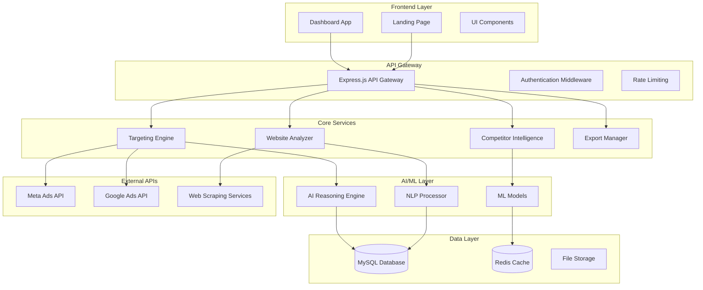
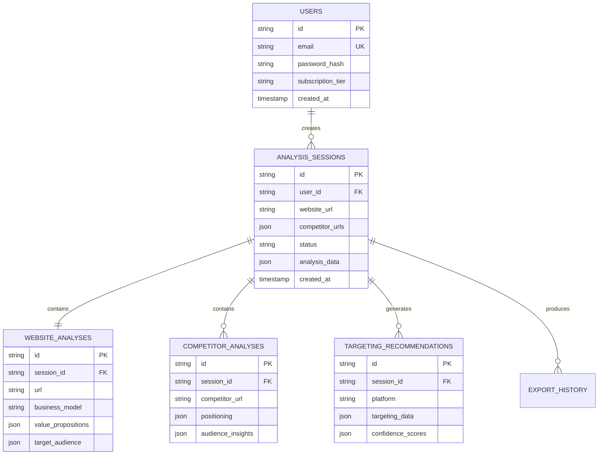

# Design Document: RiseRoutes AI Ads Intelligence Platform

## Overview

RiseRoutes is a sophisticated AI-powered platform that analyzes websites and competitors to generate actionable Meta and Google Ads targeting recommendations. The system combines advanced web scraping, natural language processing, and machine learning to provide zero-learning-curve insights with clear explanations of the "why" behind each recommendation.

The platform follows a modern, insight-first approach that prioritizes user understanding over complex configuration. Built with React frontend, Node.js backend, and MySQL database, it delivers a premium experience reminiscent of Stripe's polish, Notion's clarity, and ChatGPT's intelligence.

## Architecture

### High-Level System Architecture



### Technology Stack

**Frontend:**
- React 18 with TypeScript
- Tailwind CSS for styling
- Framer Motion for animations
- React Query for state management
- Chart.js for data visualization

**Backend:**
- Node.js with Express.js
- TypeScript for type safety
- JWT for authentication
- Bull Queue for background jobs
- Winston for logging

**Database:**
- MySQL 8.0 for primary data storage
- Redis for caching and session management
- File system for temporary analysis artifacts

**AI/ML:**
- OpenAI GPT-4 for content analysis and reasoning
- Custom NLP models for keyword extraction
- TensorFlow.js for client-side processing
- Puppeteer for web scraping

## Components and Interfaces

### 1. Website Analyzer Service

**Purpose:** Extracts and analyzes website content to understand business model, target audience, and value propositions.

**Key Methods:**
```typescript
interface WebsiteAnalyzer {
  analyzeWebsite(url: string, options: AnalysisOptions): Promise<WebsiteAnalysis>
  extractContent(url: string): Promise<WebsiteContent>
  identifyBusinessModel(content: WebsiteContent): Promise<BusinessModel>
  extractValuePropositions(content: WebsiteContent): Promise<ValueProposition[]>
  analyzeUserJourney(content: WebsiteContent): Promise<UserJourney>
}

interface WebsiteAnalysis {
  businessModel: BusinessModel
  valuePropositions: ValueProposition[]
  targetAudience: AudienceInsights
  contentThemes: ContentTheme[]
  userJourney: UserJourney
  technicalMetadata: TechnicalMetadata
}
```

**Analysis Process:**
1. URL validation and accessibility check
2. Content extraction using Puppeteer
3. Text analysis using NLP for key themes
4. Business model classification
5. Value proposition extraction
6. Audience signal identification

### 2. Competitor Intelligence Service

**Purpose:** Analyzes competitor websites and advertising strategies to identify market opportunities and gaps.

**Key Methods:**
```typescript
interface CompetitorIntelligence {
  analyzeCompetitors(urls: string[]): Promise<CompetitorAnalysis[]>
  identifyMarketGaps(competitors: CompetitorAnalysis[], target: WebsiteAnalysis): Promise<MarketGap[]>
  extractCompetitorPositioning(analysis: CompetitorAnalysis): Promise<Positioning>
  compareAudienceStrategies(competitors: CompetitorAnalysis[]): Promise<AudienceComparison>
}

interface CompetitorAnalysis {
  url: string
  businessModel: BusinessModel
  positioning: Positioning
  targetAudience: AudienceInsights
  contentStrategy: ContentStrategy
  estimatedAdSpend: AdSpendEstimate
  marketShare: MarketShareData
}
```

**Analysis Features:**
- Competitive positioning analysis
- Market gap identification
- Audience overlap detection
- Content strategy comparison
- Opportunity scoring

### 3. Targeting Engine Service

**Purpose:** Generates Meta and Google Ads targeting recommendations based on website and competitor analysis.

**Key Methods:**
```typescript
interface TargetingEngine {
  generateMetaTargeting(analysis: WebsiteAnalysis, competitors: CompetitorAnalysis[]): Promise<MetaTargeting>
  generateGoogleTargeting(analysis: WebsiteAnalysis, competitors: CompetitorAnalysis[]): Promise<GoogleTargeting>
  calculateConfidenceScores(targeting: TargetingRecommendation): Promise<ConfidenceScore[]>
  explainRecommendations(targeting: TargetingRecommendation): Promise<RecommendationExplanation[]>
}

interface MetaTargeting {
  demographics: DemographicTargeting
  interests: InterestTargeting[]
  behaviors: BehaviorTargeting[]
  customAudiences: CustomAudienceRecommendation[]
  lookalikeSuggestions: LookalikeAudience[]
  confidenceScores: ConfidenceScore[]
}

interface GoogleTargeting {
  keywords: KeywordCluster[]
  audiences: GoogleAudience[]
  demographics: DemographicTargeting
  placements: PlacementRecommendation[]
  confidenceScores: ConfidenceScore[]
}
```

**Targeting Logic:**
- Business model-based audience mapping
- Intent-driven keyword clustering
- Competitive gap targeting
- Confidence scoring algorithm
- Policy compliance validation

### 4. Export Manager Service

**Purpose:** Handles data export in various formats for different platforms and use cases.

**Key Methods:**
```typescript
interface ExportManager {
  exportMetaAudiences(targeting: MetaTargeting, format: ExportFormat): Promise<ExportResult>
  exportGoogleKeywords(targeting: GoogleTargeting, format: ExportFormat): Promise<ExportResult>
  generateClientReport(analysis: AnalysisSession): Promise<ClientReport>
  copyToClipboard(data: TargetingData, platform: AdPlatform): Promise<ClipboardData>
}

interface ExportResult {
  filename: string
  format: ExportFormat
  data: Buffer | string
  metadata: ExportMetadata
}
```

**Export Formats:**
- CSV for direct platform import
- JSON for API integration
- PDF for client presentations
- Clipboard-ready text formats

### 5. Dashboard Interface Components

**Purpose:** Provides intuitive UI components for displaying analysis results and insights.

**Key Components:**

```typescript
// Audience Card Component
interface AudienceCard {
  audience: AudienceSegment
  funnelStage: FunnelStage
  confidenceScore: number
  explanation: string
  actions: AudienceAction[]
}

// Intent Cluster Component
interface IntentCluster {
  intent: UserIntent
  keywords: Keyword[]
  searchVolume: number
  competitionLevel: CompetitionLevel
  opportunities: Opportunity[]
}

// Competitor Radar Chart
interface CompetitorRadar {
  competitors: CompetitorData[]
  metrics: RadarMetric[]
  opportunities: OpportunityGap[]
  recommendations: string[]
}
```

## Data Models

### Core Data Entities

```sql
-- Analysis Sessions
CREATE TABLE analysis_sessions (
    id VARCHAR(36) PRIMARY KEY,
    user_id VARCHAR(36) NOT NULL,
    website_url VARCHAR(500) NOT NULL,
    target_location VARCHAR(100),
    competitor_urls JSON,
    status ENUM('pending', 'processing', 'completed', 'failed') DEFAULT 'pending',
    created_at TIMESTAMP DEFAULT CURRENT_TIMESTAMP,
    completed_at TIMESTAMP NULL,
    analysis_data JSON,
    INDEX idx_user_created (user_id, created_at),
    INDEX idx_status (status)
);

-- Website Analysis Results
CREATE TABLE website_analyses (
    id VARCHAR(36) PRIMARY KEY,
    session_id VARCHAR(36) NOT NULL,
    url VARCHAR(500) NOT NULL,
    business_model VARCHAR(100),
    value_propositions JSON,
    target_audience JSON,
    content_themes JSON,
    technical_metadata JSON,
    analysis_timestamp TIMESTAMP DEFAULT CURRENT_TIMESTAMP,
    FOREIGN KEY (session_id) REFERENCES analysis_sessions(id) ON DELETE CASCADE,
    INDEX idx_session (session_id),
    INDEX idx_url (url)
);

-- Competitor Analysis Results
CREATE TABLE competitor_analyses (
    id VARCHAR(36) PRIMARY KEY,
    session_id VARCHAR(36) NOT NULL,
    competitor_url VARCHAR(500) NOT NULL,
    positioning JSON,
    audience_insights JSON,
    content_strategy JSON,
    market_share_data JSON,
    analysis_timestamp TIMESTAMP DEFAULT CURRENT_TIMESTAMP,
    FOREIGN KEY (session_id) REFERENCES analysis_sessions(id) ON DELETE CASCADE,
    INDEX idx_session (session_id),
    INDEX idx_competitor_url (competitor_url)
);

-- Targeting Recommendations
CREATE TABLE targeting_recommendations (
    id VARCHAR(36) PRIMARY KEY,
    session_id VARCHAR(36) NOT NULL,
    platform ENUM('meta', 'google') NOT NULL,
    targeting_data JSON NOT NULL,
    confidence_scores JSON,
    explanations JSON,
    created_at TIMESTAMP DEFAULT CURRENT_TIMESTAMP,
    FOREIGN KEY (session_id) REFERENCES analysis_sessions(id) ON DELETE CASCADE,
    INDEX idx_session_platform (session_id, platform)
);

-- Export History
CREATE TABLE export_history (
    id VARCHAR(36) PRIMARY KEY,
    session_id VARCHAR(36) NOT NULL,
    export_type ENUM('meta_csv', 'google_csv', 'client_report', 'clipboard') NOT NULL,
    filename VARCHAR(255),
    export_data JSON,
    created_at TIMESTAMP DEFAULT CURRENT_TIMESTAMP,
    FOREIGN KEY (session_id) REFERENCES analysis_sessions(id) ON DELETE CASCADE,
    INDEX idx_session_type (session_id, export_type),
    INDEX idx_created (created_at)
);

-- Users and Authentication
CREATE TABLE users (
    id VARCHAR(36) PRIMARY KEY,
    email VARCHAR(255) UNIQUE NOT NULL,
    password_hash VARCHAR(255) NOT NULL,
    first_name VARCHAR(100),
    last_name VARCHAR(100),
    company VARCHAR(200),
    subscription_tier ENUM('free', 'pro', 'enterprise') DEFAULT 'free',
    created_at TIMESTAMP DEFAULT CURRENT_TIMESTAMP,
    last_login TIMESTAMP NULL,
    INDEX idx_email (email),
    INDEX idx_subscription (subscription_tier)
);

-- Analysis Cache for Performance
CREATE TABLE analysis_cache (
    id VARCHAR(36) PRIMARY KEY,
    cache_key VARCHAR(255) UNIQUE NOT NULL,
    cache_data JSON NOT NULL,
    expires_at TIMESTAMP NOT NULL,
    created_at TIMESTAMP DEFAULT CURRENT_TIMESTAMP,
    INDEX idx_cache_key (cache_key),
    INDEX idx_expires (expires_at)
);
```

### Data Relationships



Now I need to use the prework tool to analyze the acceptance criteria before writing the Correctness Properties section.

<function_calls>
<invoke name="prework">
<parameter name="featureName">ai-ads-intelligence-platform