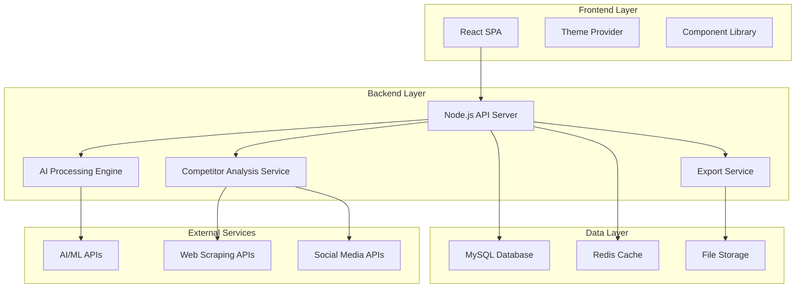

# Design Document

## Overview

RiseRoutes is an AI-powered ads intelligence platform that transforms website analysis into actionable targeting recommendations for Meta and Google Ads. The system follows a clean, insight-first architecture inspired by Stripe, Notion, and ChatGPT, prioritizing user experience with zero learning curve and intelligent explanations.

The platform operates through a streamlined flow: users input their website URL and optional competitor URLs, the AI engine analyzes content and market positioning, and the system generates comprehensive targeting recommendations with confidence scores and explanations. The architecture supports real-time processing, progressive status updates, and multiple export formats.

## Architecture

### System Architecture

The platform follows a modern three-tier architecture:



### Technology Stack

**Frontend:**
- React 18 with functional components and hooks
- Context API for theme management and global state
- CSS-in-JS with styled-components for dynamic theming
- React Router for navigation
- Axios for API communication
- Framer Motion for micro-animations

**Backend:**
- Node.js with Express.js framework
- JWT-based authentication
- Connection pooling for MySQL
- Redis for caching and session management
- Multer for file uploads
- Rate limiting and security middleware

**Database:**
- MySQL 8.0 for relational data storage
- Redis for caching and real-time data
- Structured schema with proper indexing

**External Integrations:**
- OpenAI/Claude APIs for content analysis
- Web scraping services for competitor analysis
- Social media APIs for audience insights

## Components and Interfaces

### Frontend Components

#### Core Layout Components
- **AppShell**: Main application wrapper with theme provider
- **Navigation**: Responsive navigation with theme toggle
- **Dashboard**: Tabbed interface for analysis results
- **LoadingStates**: Progressive loading with status messages

#### Analysis Components
- **URLInput**: Website URL input with validation
- **CompetitorInput**: Optional competitor URL collection
- **AnalysisProgress**: Real-time progress indicator with AI status messages
- **ResultsTabs**: Tabbed interface for different analysis views

#### Results Display Components
- **OverviewCard**: Executive summary with key metrics
- **AudienceCard**: Meta Ads audience recommendations with confidence meters
- **KeywordCluster**: Google Ads keyword groups with intent classification
- **CompetitorInsights**: Competitor analysis and opportunity identification
- **RecommendationCard**: Actionable recommendations with color coding

#### Export Components
- **ExportPanel**: Multi-format export options
- **ShareDialog**: Client-friendly report sharing
- **CopyToClipboard**: Quick implementation helpers

### Backend API Endpoints

#### Authentication Endpoints
```
POST /api/auth/register
POST /api/auth/login
POST /api/auth/refresh
POST /api/auth/logout
```

#### Analysis Endpoints
```
POST /api/analysis/start
GET /api/analysis/:id/status
GET /api/analysis/:id/results
POST /api/analysis/:id/export
```

#### User Management Endpoints
```
GET /api/user/profile
PUT /api/user/profile
GET /api/user/analyses
DELETE /api/user/analyses/:id
```

#### Data Endpoints
```
GET /api/competitors/:domain
POST /api/feedback
GET /api/templates/export
```

### Service Interfaces

#### AI Analysis Service
```typescript
interface AnalysisService {
  analyzeWebsite(url: string): Promise<WebsiteAnalysis>
  generateAudiences(analysis: WebsiteAnalysis): Promise<AudienceRecommendation[]>
  generateKeywords(analysis: WebsiteAnalysis): Promise<KeywordCluster[]>
  analyzeCompetitors(urls: string[]): Promise<CompetitorInsights>
}
```

#### Export Service
```typescript
interface ExportService {
  exportMetaAudiences(audiences: AudienceRecommendation[], format: ExportFormat): Promise<ExportResult>
  exportGoogleKeywords(keywords: KeywordCluster[], format: ExportFormat): Promise<ExportResult>
  generateClientReport(analysis: AnalysisResult): Promise<ShareableReport>
}
```

## Data Models

### Core Data Models

#### User Model
```sql
CREATE TABLE users (
  id INT PRIMARY KEY AUTO_INCREMENT,
  email VARCHAR(255) UNIQUE NOT NULL,
  password_hash VARCHAR(255) NOT NULL,
  first_name VARCHAR(100),
  last_name VARCHAR(100),
  company VARCHAR(255),
  theme_preference ENUM('light', 'dark', 'auto') DEFAULT 'auto',
  created_at TIMESTAMP DEFAULT CURRENT_TIMESTAMP,
  updated_at TIMESTAMP DEFAULT CURRENT_TIMESTAMP ON UPDATE CURRENT_TIMESTAMP
);
```

#### Analysis Model
```sql
CREATE TABLE analyses (
  id INT PRIMARY KEY AUTO_INCREMENT,
  user_id INT NOT NULL,
  website_url VARCHAR(500) NOT NULL,
  competitor_urls JSON,
  status ENUM('pending', 'processing', 'completed', 'failed') DEFAULT 'pending',
  website_analysis JSON,
  audience_recommendations JSON,
  keyword_clusters JSON,
  competitor_insights JSON,
  confidence_scores JSON,
  created_at TIMESTAMP DEFAULT CURRENT_TIMESTAMP,
  completed_at TIMESTAMP NULL,
  FOREIGN KEY (user_id) REFERENCES users(id) ON DELETE CASCADE
);
```

#### Export History Model
```sql
CREATE TABLE export_history (
  id INT PRIMARY KEY AUTO_INCREMENT,
  analysis_id INT NOT NULL,
  export_type ENUM('meta_audiences', 'google_keywords', 'client_report') NOT NULL,
  export_format ENUM('csv', 'json', 'pdf', 'link') NOT NULL,
  file_path VARCHAR(500),
  share_token VARCHAR(100),
  created_at TIMESTAMP DEFAULT CURRENT_TIMESTAMP,
  expires_at TIMESTAMP,
  FOREIGN KEY (analysis_id) REFERENCES analyses(id) ON DELETE CASCADE
);
```

#### Competitor Data Model
```sql
CREATE TABLE competitor_data (
  id INT PRIMARY KEY AUTO_INCREMENT,
  domain VARCHAR(255) UNIQUE NOT NULL,
  content_analysis JSON,
  audience_insights JSON,
  last_analyzed TIMESTAMP DEFAULT CURRENT_TIMESTAMP,
  analysis_count INT DEFAULT 1,
  INDEX idx_domain (domain),
  INDEX idx_last_analyzed (last_analyzed)
);
```

### Data Transfer Objects

#### Website Analysis DTO
```typescript
interface WebsiteAnalysis {
  domain: string
  businessType: string
  services: string[]
  targetAudience: {
    demographics: Demographics
    psychographics: Psychographics
    painPoints: string[]
  }
  contentThemes: string[]
  brandTone: string
  competitiveAdvantages: string[]
  confidenceScore: number
}
```

#### Audience Recommendation DTO
```typescript
interface AudienceRecommendation {
  id: string
  name: string
  description: string
  interests: string[]
  behaviors: string[]
  demographics: Demographics
  funnelStage: 'awareness' | 'consideration' | 'decision'
  creativeAngles: string[]
  confidenceScore: number
  priority: 'high' | 'medium' | 'low'
  estimatedReach: number
}
```

#### Keyword Cluster DTO
```typescript
interface KeywordCluster {
  id: string
  theme: string
  intent: 'informational' | 'commercial' | 'transactional'
  funnelStage: 'awareness' | 'consideration' | 'decision'
  keywords: {
    term: string
    matchType: 'broad' | 'phrase' | 'exact'
    searchVolume: number
    competition: 'low' | 'medium' | 'high'
    suggestedBid: number
  }[]
  negativeKeywords: string[]
  confidenceScore: number
}
```

## Error Handling

### Error Classification

#### Client Errors (4xx)
- **400 Bad Request**: Invalid URL format, missing required fields
- **401 Unauthorized**: Invalid or expired authentication tokens
- **403 Forbidden**: Insufficient permissions for resource access
- **404 Not Found**: Analysis or resource not found
- **429 Too Many Requests**: Rate limit exceeded

#### Server Errors (5xx)
- **500 Internal Server Error**: Unexpected server failures
- **502 Bad Gateway**: External API failures (AI services, scraping APIs)
- **503 Service Unavailable**: Temporary service overload
- **504 Gateway Timeout**: AI processing timeout

### Error Handling Strategy

#### Frontend Error Handling
```typescript
interface ErrorBoundary {
  handleAPIError(error: APIError): void
  handleNetworkError(error: NetworkError): void
  displayUserFriendlyMessage(error: Error): string
  logErrorForDebugging(error: Error): void
}
```

#### Backend Error Handling
```typescript
interface ErrorHandler {
  validateInput(data: any, schema: Schema): ValidationResult
  handleDatabaseError(error: DatabaseError): APIResponse
  handleExternalAPIError(error: ExternalAPIError): APIResponse
  logError(error: Error, context: RequestContext): void
}
```

#### Graceful Degradation
- **Partial Analysis Results**: Display available insights even if some components fail
- **Cached Competitor Data**: Use previously analyzed competitor data when fresh analysis fails
- **Fallback Recommendations**: Provide industry-standard recommendations when AI analysis fails
- **Progressive Enhancement**: Core functionality works without advanced features

## Testing Strategy

### Dual Testing Approach

The testing strategy combines unit testing for specific scenarios with property-based testing for comprehensive validation of universal properties. Unit tests focus on concrete examples, edge cases, and integration points, while property tests verify that system behaviors hold across all possible inputs.

### Unit Testing Strategy

**Frontend Unit Tests:**
- Component rendering and user interactions
- Theme switching and responsive behavior
- Form validation and error states
- API integration and error handling
- Export functionality and clipboard operations

**Backend Unit Tests:**
- API endpoint responses and error codes
- Authentication and authorization flows
- Database operations and data validation
- External API integration and fallback handling
- Export generation and file operations

**Testing Tools:**
- Jest for test runner and assertions
- React Testing Library for component testing
- Supertest for API endpoint testing
- Mock Service Worker for API mocking

### Property-Based Testing Strategy

Property-based testing validates universal properties across randomized inputs, ensuring system correctness at scale. Each property test runs a minimum of 100 iterations with generated test data.

**Property Testing Library:** fast-check for JavaScript/TypeScript property-based testing

**Property Test Configuration:**
- Minimum 100 iterations per property test
- Custom generators for domain-specific data (URLs, business types, audience demographics)
- Shrinking enabled to find minimal failing examples
- Each test tagged with: **Feature: ai-ads-intelligence-platform, Property {number}: {property_text}**

### Integration Testing

**API Integration Tests:**
- End-to-end analysis workflow from URL input to results
- Authentication flow and session management
- Export generation and file download
- Error handling across service boundaries

**Database Integration Tests:**
- Data persistence and retrieval accuracy
- Transaction handling and rollback scenarios
- Connection pooling and performance under load

## Correctness Properties

*A property is a characteristic or behavior that should hold true across all valid executions of a system—essentially, a formal statement about what the system should do. Properties serve as the bridge between human-readable specifications and machine-verifiable correctness guarantees.*

### Property Reflection

After analyzing all acceptance criteria, several properties can be consolidated to eliminate redundancy:

- Properties about "all recommendations having confidence scores" and "all audiences having confidence meters" can be combined into a single comprehensive property
- Properties about "all content having required fields" (audience cards, keyword clusters) can be unified into data completeness properties
- Properties about "all items having proper organization" (funnel stages, priorities, intent classification) can be combined into classification properties
- Properties about "all data being stored correctly" can be consolidated into data persistence properties

### Core Properties

**Property 1: URL Validation Consistency**
*For any* URL input, the validation system should correctly identify valid URLs as acceptable and invalid URLs as unacceptable, with appropriate error messages for invalid cases
**Validates: Requirements 2.4, 2.5**

**Property 2: AI Analysis Completeness**
*For any* valid website URL, the AI engine should generate complete analysis results including services identification, target audience demographics, and business model classification
**Validates: Requirements 3.2, 3.3, 3.4, 3.5**

**Property 3: Recommendation Data Completeness**
*For any* generated recommendation (audience or keyword), it should contain all required fields including confidence scores, classifications, and explanatory content
**Validates: Requirements 5.2, 5.3, 5.4, 5.5, 6.3, 6.5**

**Property 4: Priority and Classification Consistency**
*For any* set of recommendations, all items should have valid priority classifications (Green/Yellow/Red) and appropriate funnel stage assignments (Awareness/Consideration/Decision)
**Validates: Requirements 5.6, 6.2, 6.6**

**Property 5: Explanation Completeness**
*For any* score, recommendation, or insight displayed to users, it should include explanatory content or "Why this matters" information
**Validates: Requirements 4.5, 8.5, 10.4**

**Property 6: Export Generation Reliability**
*For any* completed analysis, the system should be able to generate shareable reports and export data in the requested formats without data loss
**Validates: Requirements 9.4**

**Property 7: Data Persistence Integrity**
*For any* user action that should persist data (analysis results, user preferences, export history), the data should be correctly stored and retrievable in subsequent sessions
**Validates: Requirements 11.3, 11.4, 12.1, 12.3, 12.4**

**Property 8: Competitor Analysis Consistency**
*For any* set of competitor URLs, the analysis should identify behavioral patterns, opportunity gaps, and differentiation strategies based on the competitive landscape
**Validates: Requirements 7.2, 7.3, 7.4, 7.5**

**Property 9: Diagnostic Recommendation Completeness**
*For any* targeting scenario analysis, the system should identify issues and provide corresponding solution recommendations with impact prioritization
**Validates: Requirements 8.2, 8.3, 8.4**

**Property 10: Authentication Security**
*For any* user credential storage and session management operation, the system should maintain security standards including proper encryption and secure session handling
**Validates: Requirements 11.2**

**Property 11: Smart Defaults Consistency**
*For any* user input form or configuration interface, appropriate default values should be provided to minimize required user decisions
**Validates: Requirements 10.6**

**Property 12: Competitor Data Reuse Efficiency**
*For any* competitor domain that has been previously analyzed, the system should reuse existing intelligence data while ensuring freshness when needed
**Validates: Requirements 12.2**